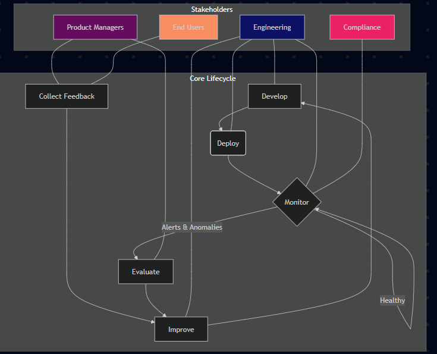

# LLMOps Foundations: A Practical Chatbot Framework

This project serves as a foundational implementation of an LLMOps framework for a customer-facing chatbot. It addresses the critical need for robust monitoring, safety, and continuous improvement in a production AI application. The goal is to move from a "just launched" prototype to a scalable, reliable, and compliant system by implementing core MLOps principles.

This repository contains the code, diagrams, and documentation for the monitoring, feedback, and versioning systems required to manage the chatbot's lifecycle effectively.

> **Note:** This project was built to satisfy the requirements of the LLMOps Masterclass. Relevant course content links can be added here.

## System Architecture: The LLMOps Lifecycle

The chatbot's operational model is a continuous, iterative loop. This ensures that the application is not just deployed but is constantly observed, evaluated, and improved based on both automated monitoring and human feedback.



---

## 🚀 Getting Started

Follow these steps to set up and run the project locally.

### Prerequisites

- Python 3.10+
- Git

### Onboarding & Setup

**Clone the repository:**

```bash
git clone https://github.com/YOUR_USERNAME/llmops-foundations-bootcamp.git
cd llmops-foundations-bootcamp
```

**Create a virtual environment (recommended):**

```bash
python -m venv venv
source venv/bin/activate  # On Windows, use `venv\Scripts\activate`
```

**Install dependencies:**

> This project uses only standard Python libraries, so this file is intentionally empty, but running the command is a good practice.

```bash
pip install -r requirements.txt
```

---

## 🛠️ How to Use the System

This project contains two primary tools: a monitoring simulation script and a feedback collection CLI.

### 1. Monitoring Simulation

The `monitoring.py` script simulates a real-time monitoring agent. It reads a sample log file of chatbot interactions, analyzes each one for risks, and prints a structured JSON log to the console.

**To run the simulation:**

```bash
python src/monitoring.py
```

**Expected Output:**

You will see a stream of JSON objects printed to your terminal, each representing a monitored interaction with added metadata like `latency_ms`, `pii_detected`, and `error`.

### 2. Feedback Collection

The `feedback_collector.py` script is a command-line tool for capturing and storing feedback from users or internal stakeholders.

**To submit feedback, use the following format:**

```bash
python src/feedback_collector.py --user-id "USER_ID" --feedback-type "TYPE" --description "YOUR_FEEDBACK"
```

**Example Scenarios:**

Submitting a bug report:

```bash
python src/feedback_collector.py --user-id "user_999" --feedback-type "bug_report" --description "The chatbot provided an incorrect link for the pricing page."
```

Submitting a suggestion:

```bash
python src/feedback_collector.py --user-id "pm_jane" --feedback-type "suggestion" --description "The chatbot should be able to retrieve order history."
```

Feedback is saved to the `chatbot_feedback.jsonl` file in the project's root directory.

---

## 🔄 Versioning and Rollback Strategy

A robust versioning strategy is critical for maintaining stability and enabling rapid recovery from failures.

### Branching Model

- **main:** The primary development branch. All new features and fixes are merged here. It represents the "next" version of the application.
- **stable:** This branch represents the current, live production code. It is only updated by merging from main when a new version is ready for release.

### Emergency Rollback Procedure

If a critical bug is discovered in production (deployed from the stable branch), follow these steps to immediately revert to the last known good version.

1. Identify the last stable commit/tag. Use `git log` on the stable branch to find the commit hash of the previous stable release (e.g., `a1b2c3d`).
2. Checkout the stable branch:
	```bash
	git checkout stable
	```
3. Reset the branch to the previous stable commit:
	```bash
	git reset --hard a1b2c3d
	```
4. Force-push the change to the remote repository.
	> **Warning:** Use `--force` with extreme caution. This is only appropriate in an emergency rollback scenario for a protected branch like stable.
	```bash
	git push origin stable --force
	```
5. Trigger a new deployment from the stable branch. The infrastructure team can now safely redeploy the last working version.

---

## 💡 Key Design Decisions

- **Logging to Standard Output (stdout):** The monitoring script prints logs to the console instead of a file. This is intentional. It simulates modern cloud-native applications that stream logs, allowing the execution environment (e.g., Docker, Kubernetes) to decide how to collect, route, and store them.
- **CLI for Feedback Collection:** A command-line tool was chosen to simulate a simple, stateless API endpoint. It's a lightweight way to demonstrate the functionality of collecting and storing structured data without the overhead of setting up a full web server.
- **Standard Libraries Only:** The project intentionally avoids external frameworks to keep it simple, fast, and dependency-free. This focuses the solution on core logic and foundational principles rather than specific tools.

---

## 🛡️ Privacy & Compliance

This framework includes a foundational layer for privacy protection. The `monitoring.py` script actively scans all chatbot responses for common Personally Identifiable Information (PII) patterns, such as emails and phone numbers.

**Purpose:** This is a critical first line of defense to prevent accidental data leaks, protect user privacy, and mitigate risks of non-compliance with regulations like GDPR and CCPA.

**Action:** Any detection of PII is flagged in the logs (`"pii_detected": true`), which in a real system would trigger an immediate, high-priority alert for the compliance and security teams.

---

## 📁 Project Directory Structure

```text
llmops-foundations-bootcamp/
├── docs/
│   ├── lifecycle_map.md
│   └── monitoring_flow.md
├── src/
│   ├── monitoring.py
│   └── feedback_collector.py
├── .gitignore
├── README.md
├── requirements.txt
└── sample_chatbot_logs.jsonl
```
python src/feedback_collector.py --user-id "user_999" --feedback-type "bug_report" --description "The chatbot provided an incorrect link for the pricing page."
Submitting a suggestion:
code
Bash
python src/feedback_collector.py --user-id "pm_jane" --feedback-type "suggestion" --description "The chatbot should be able to retrieve order history."
Feedback is saved to the chatbot_feedback.jsonl file in the project's root directory.
🔄 Versioning and Rollback Strategy
A robust versioning strategy is critical for maintaining stability and enabling rapid recovery from failures.
Branching Model
main: The primary development branch. All new features and fixes are merged here. It represents the "next" version of the application.
stable: This branch represents the current, live production code. It is only updated by merging from main when a new version is ready for release.
Emergency Rollback Procedure
If a critical bug is discovered in production (deployed from the stable branch), follow these steps to immediately revert to the last known good version.
Identify the last stable commit/tag. Use git log on the stable branch to find the commit hash of the previous stable release (e.g., a1b2c3d).
Checkout the stable branch:
code
Bash
git checkout stable
Reset the branch to the previous stable commit:
code
Bash
git reset --hard a1b2c3d
Force-push the change to the remote repository.
(Warning: Use --force with extreme caution. This is only appropriate in an emergency rollback scenario for a protected branch like stable.)
code
Bash
git push origin stable --force
Trigger a new deployment from the stable branch. The infrastructure team can now safely redeploy the last working version.
💡 Key Design Decisions
Logging to Standard Output (stdout): The monitoring script prints logs to the console instead of a file. This is intentional. It simulates modern cloud-native applications that stream logs, allowing the execution environment (e.g., Docker, Kubernetes) to decide how to collect, route, and store them.
CLI for Feedback Collection: A command-line tool was chosen to simulate a simple, stateless API endpoint. It's a lightweight way to demonstrate the functionality of collecting and storing structured data without the overhead of setting up a full web server.
Standard Libraries Only: The project intentionally avoids external frameworks to keep it simple, fast, and dependency-free. This focuses the solution on core logic and foundational principles rather than specific tools.
🛡️ Privacy & Compliance
This framework includes a foundational layer for privacy protection. The monitoring.py script actively scans all chatbot responses for common Personally Identifiable Information (PII) patterns, such as emails and phone numbers.
Purpose: This is a critical first line of defense to prevent accidental data leaks, protect user privacy, and mitigate risks of non-compliance with regulations like GDPR and CCPA.
Action: Any detection of PII is flagged in the logs ("pii_detected": true), which in a real system would trigger an immediate, high-priority alert for the compliance and security teams.
📁 Project Directory Structure
code
Code
llmops-foundations-bootcamp/
├── docs/
│   ├── lifecycle_map.md
│   └── monitoring_flow.md
├── src/
│   ├── monitoring.py
│   └── feedback_collector.py
├── .gitignore
├── README.md
├── requirements.txt
└── sample_chatbot_logs.jsonl